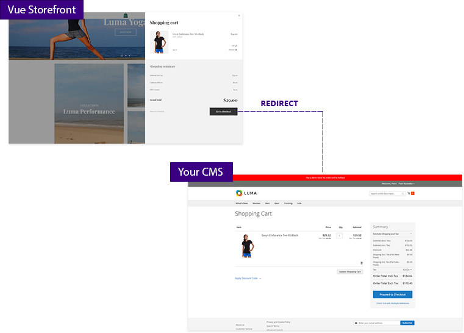

# Vue Storefront External Checkout

With this extension you can use your CMS checkout (e.g. Magento) instead of default [Vue Storefront](https://github.com/DivanteLtd/vue-storefront) checkout.
This plugin requires cart and user sync on your backend (see [integrations](https://github.com/filrak/vsf-external-checkout#current-cms-integrations-for-this-extension) )

See [live demo](https://demo-magento-checkout.vuestorefront.io/) - add something to your cart and proceed to checkout.
<center>

</center>

## Current CMS integrations for this extension

* [Magento 2](https://github.com/DivanteLtd/magento2-external-checkout)


## How it works?

When user tries to enter your Vue Storefront checkout:
1. The extension synchronizes cart and user data with your backend CMS
2. User is redirected to your CMS checkout (extension overrides `/checkout` route).

## Installation

1. Install the extension on your Vue Storefront instance
````
yarn install vsf-external-checkout-module --save
````
2. Add CMS address to your `config/local.json` file.
````json
"externalCheckout": {
  "cmsUrl" : "https://yourcmsaddress.com"
}
````
3. Enable cart synchronization for your Vue Storefront instance in `config/local.json`
````
cart": {
  "synchronize": true,
  ...
}
````
4. Register the extension in `src/modules/index.ts` file
````js
import { ExternalCheckout} from "./external-checkout"

export const registerModules: VueStorefrontModule[] = [
   // other extensions
  ExternalCheckout
]
````

## How to use for a specific stores in a multistore setup

You can specify which storeviews should use the external checkout by adding each store code to your `config/local.json` file.
````js
"externalCheckout": {
  "cmsUrl" : "https://yourcmsaddress.com",
  "stores": {
    "se": {
      "cmsUrl": "https://yourcmsaddress.com"
    },
    "dk": {
      "cmsUrl": "https://yourcmsaddress.com"
    }
  }
}
````

## How to integrate with other CMS

If you want to integrate this extension with your backend CMS make sure that entering `{your_CMS_url}/vue/cart/sync/token/{user-token}/cart/{cart_token}` will do the following:
1. Synchronize cart and user data between Vue Storefront and your CMS
2. Redirect user to external checkout
